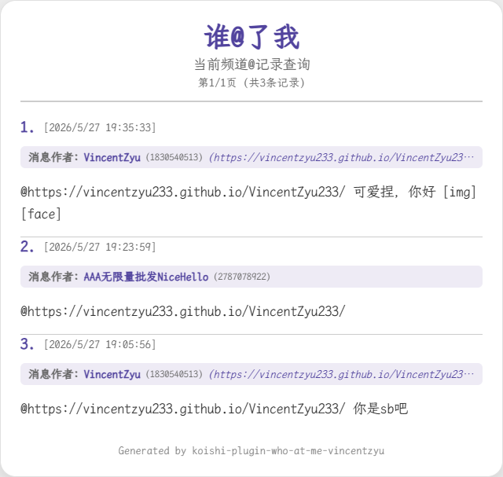

# koishi-plugin-who-at-me-vincentzyu

📬 谁艾特我：自动监听并记录群聊中的 @ 消息，支持分页查询、三种输出格式、自定义渲染。

[](https://www.npmjs.com/package/koishi-plugin-who-at-me-vincentzyu)
[](https://www.npmjs.com/package/koishi-plugin-who-at-me-vincentzyu)

[](https://github.com/VincentZyuApps/koishi-plugin-who-at-me-vincentzyu)
[](https://gitee.com/vincent-zyu/koishi-plugin-who-at-me-vincentzyu)

[](https://qm.qq.com/q/ZN7fxZ3qCq)

<p><del>💬 插件使用问题 / 🐛 Bug反馈 / 👨‍💻 插件开发交流，欢迎加入QQ群：<b>259248174</b>   🎉（这个群G了）</del></p> 
<p>💬 插件使用问题 / 🐛 Bug反馈 / 👨‍💻 插件开发交流，欢迎加入QQ群：<b>1085190201</b> 🎉</p>
<p>💡 在群里直接艾特我，回复的更快哦~ ✨</p>

---

## 📖 简介

~~谁他妈又我不在的时候艾特我了？~~
<br>
群聊消息太多，不知道谁艾特了你？

**who-at-me** 插件持续监听群聊消息，自动将 @ 行为记录到数据库，你可以随时通过指令查询最近谁提到了你，支持按当前频道或全平台检索。

## 📸 效果预览



## ✨ 功能

### 📥 自动监听 @ 消息

开启后，插件实时监听群聊中的每条消息，自动提取 @ 行为并存入数据库，支持前置/普通中间件切换。

### 📋 指令查询

```
who-at-me [目标用户] [-p 页码] [-s 每页条数] [-o 是否仅当前频道]
who-at-me <@用户>       — 查看指定用户的被艾特记录
who-at-me               — 查看自己的被艾特记录
```

### 🖼️ 三种输出格式

| 格式 | 说明 |
|------|------|
| **📝 文本** | 纯文本分页展示，通用性强 |
| **🖼️ 图片** | Puppeteer 渲染 HTML 为图片，支持主题色/字体/颜色自定义 |
| **📎 合并转发** | 合并转发消息展示（目前仅 onebot 平台支持） |

### 🎨 自定义渲染（图片格式）

- **10 种颜色自定义**：主题色、页面背景、卡片背景、边框、主/副文字、分隔线、作者名、作者背景、页脚文字
- **🔤 自定义字体**：指定系统字体文件路径，自动嵌入图片
- **📤 截图格式可调**：支持 png / jpeg / webp，jpeg/webp 可调质量

## 📦 安装

在 Koishi 插件市场搜索 `who-at-me-vincentzyu` 即可安装。

或使用 npm / yarn：

```bash
cd /path/to/koishi-app
ls
# 确保能看到package.json, koishi.yml, data文件夹等等
npm install koishi-plugin-who-at-me-vincentzyu
# 或者用yarn
yarn add koishi-plugin-who-at-me-vincentzyu
```

## ⚙️ 配置

### 📥 数据库监听

| 配置项 | 默认值 | 说明 |
|--------|--------|------|
| `enableMiddlewareSaveAtDb` | `false` | 启用中间件监听消息并存入数据库 |
| `usePrependMiddleware` | `true` | 使用前置中间件 |

### 🎯 指令配置

| 配置项 | 默认值 | 说明 |
|--------|--------|------|
| `enableWhoAtMeCommand` | `false` | 启用 who-at-me 指令 |
| `messageForm` | `'text'` | 输出格式：`text` 文本 / `image` 图片 / `forward` 合并转发 |
| `enableTargetUserArg` | `false` | 允许在参数中传入 @ 元素查询指定用户记录 |
| `defaultPage` | `1` | 默认查看页码 |
| `defaultPageSize` | `10` | 默认每页记录数（最多 30 条） |

### 🖼️ Puppeteer 出图设置

| 配置项 | 默认值 | 说明 |
|--------|--------|------|
| `textFontPath` | `(空)` | 自定义字体文件绝对路径，留空使用默认字体 |
| `imageType` | `'png'` | 截图输出格式：`png` / `jpeg` / `webp` |
| `screenshotQuality` | `80` | 截图质量 [0-100]，仅对 jpeg/webp 生效 |

### 🎨 渲染颜色设置

| 配置项 | 默认值 | 说明 |
|--------|--------|------|
| `renderColors.primaryColor` | `#52449e` | 主题色（标题、序号） |
| `renderColors.bgColor` | `#F0F0F0` | 页面背景色 |
| `renderColors.cardBgColor` | `#FFFFFF` | 卡片背景色 |
| `renderColors.cardBorderColor` | `#E0E0E0` | 卡片边框色 |
| `renderColors.mainTextColor` | `#333333` | 主要文字颜色 |
| `renderColors.subTextColor` | `#666666` | 次要文字颜色（日期、作者ID等） |
| `renderColors.separatorColor` | `#CCCCCC` | 分隔线颜色 |
| `renderColors.authorTextColor` | `#52449e` | 作者名称文字颜色 |
| `renderColors.authorBgColor` | `#EEEBF5` | 作者信息区背景色 |
| `renderColors.footerTextColor` | `#888888` | 页脚文字颜色 |

### 🐛 调试配置

| 配置项 | 默认值 | 说明 |
|--------|--------|------|
| `enableVerboseConsoleLog` | `false` | 控制台调试日志 |
